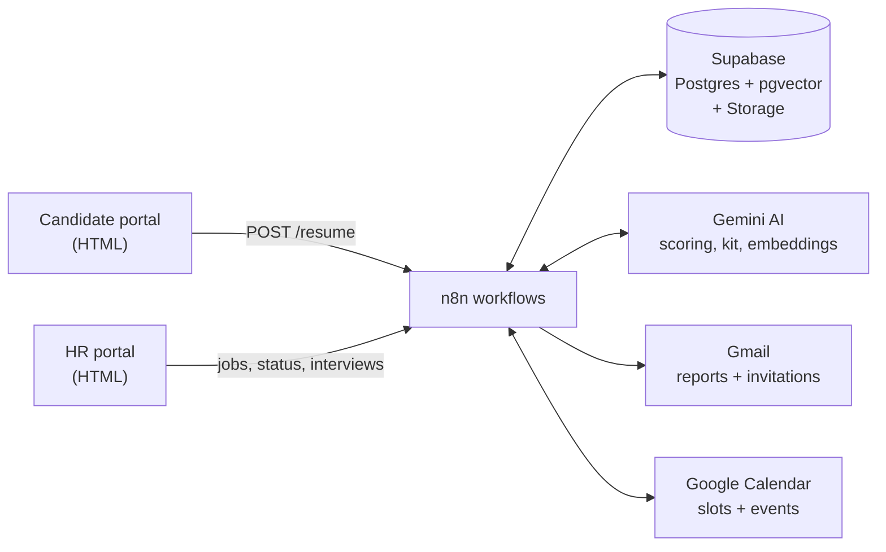

# AI-Powered Recruitment Automation System

> From CV upload to interview booking: an AI screening pipeline built with **n8n, Gemini, Supabase and Google Workspace**, with HR kept in control of every decision.


Candidates apply on a simple web page. An AI reads each CV, scores it against the job, and explains its score. HR sees ranked candidates, gets a daily report, and interviews for the best matches are booked automatically. The system also resurfaces past candidates when a new job opens or a closed job is reopened.

<!-- Add a demo video or GIF here, for example: [](YOUR_VIDEO_LINK) -->

---

## Table of contents
- [Why this project](#why-this-project)
- [Key features](#key-features)
- [Architecture](#architecture)
- [How it works](#how-it-works)
- [Responsible AI and safety](#responsible-ai-and-safety)
- [Screenshots](#screenshots)
- [Tech stack](#tech-stack)
- [Setup guide](#setup-guide)
- [Configuration](#configuration)
- [Webhook endpoints](#webhook-endpoints)
- [Known limitations and roadmap](#known-limitations-and-roadmap)
- [Repository structure](#repository-structure)
- [Author](#author)

---

## Why this project

Hiring has many repetitive, rule-based steps that suit automation. The final decision still needs human judgement.

| Challenge | What the system does |
|---|---|
| Manual CV screening is slow and grows with every applicant | Every CV arrives already read, scored and explained |
| Reviewers weigh skills differently | One weighted rubric is applied to everyone |
| Interview preparation takes time | An AI interview kit is generated per candidate |
| Scheduling means back-and-forth emails | Slots are found, booked and emailed automatically |
| Good candidates for earlier roles are forgotten | Talent-pool re-matching brings them back |
| Scanned or unreadable CVs get unfairly scored as empty | Gemini reads them visually, and failures go to HR Review, never to rejection |

## Key features

1. **AI CV scoring** against a weighted rubric, with a stored, readable reason
2. **Three-band decisions** (Shortlisted, HR Review, Not Qualified) with manual HR override
3. **Scanned-CV fallback** using Gemini document reading
4. **Prompt-injection protection** (CV text is treated as untrusted data, with injection flagging)
5. **AI job-description reading** from an uploaded PDF
6. **Automatic interview scheduling** with clash checks, working hours and a daily limit
7. **Interview management**: reschedule (manual or next free slot), cancel, reinstate, with candidate emails
8. **AI interview kit** per candidate
9. **Talent-pool re-matching** using vector search plus AI re-scoring, on new jobs and on reopened jobs
10. **Daily HR report** with Excel attachments
11. **Duplicate protection** for applications and Job IDs
12. **Failure alerts** to the technical team through an error workflow

## Architecture



### CV screening flow


### Job posting flow


### Daily schedule


## How it works

### 1. Candidate application
A candidate enters their name and email, picks an open job, uploads a PDF CV and submits. Closed jobs are not listed. Candidates never see scores or statuses and are only emailed about interviews.

After submit, the workflow:
1. **Checks for duplicates** (same name, email and job). If found, nothing is saved and the AI is not called.
2. **Stores the original CV** in Supabase Storage under a random file name.
3. **Extracts the text.** If the PDF has almost no extractable text, Gemini reads the document visually.
4. **Scores the CV** with Gemini against the job (rubric below).
5. **Applies the rules** and saves the result.
6. **Prepares extras:** the interview kit (not for Not Qualified candidates) and a CV embedding for similarity search.

### 2. Scoring and decision bands

| Criterion | Points |
|---|---|
| Required skills match | 40 |
| Preferred skills match | 20 |
| Years of experience vs minimum | 25 |
| Education and overall relevance | 15 |

| Score | Status | What happens |
|---|---|---|
| 75 to 100 | **Shortlisted** | Listed for HR and booked for an interview at 7 PM |
| 60 to 74 | **HR Review** | HR decides |
| Below 60 | **Not Qualified** | Saved, and kept in the talent pool |

### 3. HR portal
One page with three tabs:
- **Jobs:** create a job by form or by uploading a job description PDF (Gemini extracts the fields), edit it, close it, or reopen it.
- **Candidates:** pick a job, filter by status, see candidates ranked by score with the AI's reason, open the original CV, then **Shortlist** or **Reject**.
- **Interviews:** see scheduled interviews, **reschedule** (manual time or next available slot), **cancel**, or open the **interview kit**.

### 4. Daily automation
| Time | What runs |
|---|---|
| **6:00 PM** | Daily report email to HR: counts plus Excel attachments (Shortlisted, HR Review, Not Qualified) |
| *1 hour* | HR window to review and change any AI decision |
| **7:00 PM** | Interviews are booked for all eligible Shortlisted candidates |

Closing a job only stops new applications. Candidates already shortlisted for it are still scheduled.

### 5. Interview scheduling
- Only candidates with status exactly **Shortlisted**, an email, and no interview history are booked, so nobody is booked twice. Cancelled candidates are not rebooked automatically.
- Weekdays 9 AM to 5 PM (Asia/Karachi), starting the next working day.
- 10 minutes per interview, up to 50 a day. A full day rolls over to the next working day.
- Google Calendar is read first (up to 30 days ahead), so the system never books over an existing event.
- One calendar event per candidate, an invitation email via Gmail, and the record updated with the date, time and event reference.
- If no free slot exists within 30 days, the run stops and the error workflow alerts the technical team.

### 6. AI interview kit
Generated when a candidate applies (for everyone who is not Not Qualified and has a readable CV). It is opened from **Interviews > View Interview Kit**:
- 5 technical questions, each with a reason linking the CV to the job
- 2 CV verification questions
- Up to 3 CV gaps with a question to verify each
- Up to 3 points to clarify (contradictions, inconsistencies, needs verification)
- Exactly 3 focus areas

The kit uses only information in the CV and the job, ignores sensitive personal characteristics, and never recommends hiring or rejecting anyone.

### 7. Talent-pool re-matching
Triggered when HR **creates a new job** or **reopens a closed job**.

1. **Safety check.** Continues only if the job is open and has not been scanned yet. Calling it twice does nothing extra.
2. **Vector search.** The job description is embedded and compared with stored CV embeddings. The closest matches (up to 10) among past candidates with status HR Review or Not Qualified are kept.
3. **Re-score with Gemini** against the job, ignoring the earlier outcome.
4. **Keep matches scoring 60 or more.**
5. **Show HR.** Matches appear in the HR portal as **HR Review** with a "Talent pool match" note, and HR gets an email with an Excel report. If nobody matches, no email is sent.

Reopening a job works like creating one: candidates who previously applied for that same job stay in the pool and are re-evaluated. Their existing record is updated instead of duplicated. Reopening a job that is already open does nothing.

## Responsible AI and safety

The AI recommends, and HR decides.

| Risk | How it is handled |
|---|---|
| AI scores replacing human judgement | Borderline scores go to HR Review, HR can shortlist or reject anyone, and a one-hour review window precedes interview booking |
| Scanned or unreadable CV treated as empty | Gemini reads it visually. If it is still unreadable, the candidate goes to HR Review with a clear note, never to rejection |
| Invalid AI response | Candidate saved as HR Review with an "AI scoring failed" note |
| **Prompt injection** in CV text | The CV is wrapped in `<resume>` tags and the prompt tells the model it is data, never instructions. The model also reports `injection_detected`, and flagged CVs are always routed to HR Review with a warning, and are never auto-shortlisted or matched in rematching |
| Inconsistent scoring | Scoring nodes run at temperature 0 |
| Silent failures | A separate error workflow emails the technical team the failed step, the error and the time |

The system supports HR decision-making and does not replace it. Treat AI scores as recommendations.

## Screenshots

### Candidate portal


### HR portal
| Jobs | Candidates | Interviews |
|---|---|---|
|  |  |  |

### AI fallback when scoring fails


### Daily report email


### Interview scheduling
| Booked in Google Calendar | Reschedule window | Reschedule email |
|---|---|---|
|  |  |  |

### AI interview kit


### Talent-pool re-matching
| In the HR portal | Email to HR |
|---|---|
|  |  |

### Error alert email


### n8n workflow


## Tech stack

| Component | Role |
|---|---|
| **n8n** | Webhooks, orchestration, two daily schedules (6 PM report, 7 PM scheduling), error workflow |
| **Supabase** | Postgres database (`job`, `Resume`, `talent_matches`), pgvector for similarity search, Storage bucket `cvs` for original CVs |
| **Google Gemini** | CV scoring, job-description extraction, scanned-CV reading, interview kit, embeddings (`gemini-embedding-001`, 768 dimensions) |
| **Gmail** | Daily report, interview invitations, reschedule and cancel notices, talent-pool email |
| **Google Calendar** | Clash checking, event creation and rescheduling |
| **HTML / JavaScript** | `candidate-portal.html` and `hr-portal.html` front ends |

## Setup guide

### Prerequisites
- An n8n instance (self-hosted or cloud)
- A Supabase project
- A Google AI (Gemini) API key
- Google accounts for Gmail and Calendar (OAuth2 credentials in n8n)

### 1. Supabase
1. Enable the **vector** extension: `create extension if not exists vector;`
2. Create the tables:
   - **`job`**: `id`, `job_code` (unique), `job_title`, `department`, `location`, `job_description`, `required_skills`, `preferred_skills`, `min_experience_years`, `status` (`open` or `closed`), `jd_embedding` (vector 768), `talent_scanned_at` (timestamp)
   - **`Resume`**: `id`, `created_at`, `candidate_name`, `candidate_email`, `job_id`, `job_title`, `experience_yrs`, `tech_stack`, `match_score`, `status`, `analysis_summary`, `cv_url`, `cv_text`, `cv_embedding` (vector 768), `source`, `interview_status`, `interview_date`, `interview_start`, `interview_end`, `interview_event_id`, `interview_kit`
   - **`talent_matches`**: `job_id`, `resume_id`, previous job and status, `similarity`, `new_score`, `reason`, with a unique constraint on (`job_id`, `resume_id`)
3. Create a Storage bucket named **`cvs`**.
4. Run [`sql/functions.sql`](sql/functions.sql) in the SQL editor. It creates `match_candidates`, `add_talent_match_to_portal`, and a trigger that keeps repeat re-matches from failing on the unique key.

### 2. n8n
1. Import `workflow/AI-Powered_Recruitment_Automation_System.json`.
2. Create credentials and attach them to the nodes: **Supabase API**, **Google Gemini (PaLM) API**, **Gmail OAuth2**, **Google Calendar OAuth2**.
3. Replace the placeholders in the workflow: the Supabase project URL, the HR email address, the Google Calendar ID, and the `Trigger Talent Match` URL (it must point to your n8n `/webhook/talent-match` address).
4. Set the workflow timezone (the project uses `Asia/Karachi`) and create an error workflow for failure alerts.
5. Activate the workflow.

### 3. Front ends
1. In `candidate-portal.html` and `hr-portal.html`, set the webhook base URL to your n8n instance.
2. Open the pages in a browser. For a quick local run: `python -m http.server 8080`.

### 4. Try it
1. In the HR portal, create a job (by form or PDF).
2. In the candidate portal, apply with a test CV. Use a **different email for each test candidate**, because re-matching treats the email as the person's identity.
3. Check the **Candidates** tab for the score and reason.

## Configuration

| Setting | Where | Default |
|---|---|---|
| Shortlist threshold | `Score to Status` | 75 |
| HR Review threshold | `Score to Status` | 60 |
| Re-match minimum score | `Keep Fits1` | 60 |
| Vector similarity cut-off | `Find Matches1` (`match_threshold`) | 0.5 |
| Max re-match candidates | `Find Matches1` (`match_count`) | 10 |
| Interview window | `Assign Slots1` | 9 AM to 5 PM, weekdays |
| Interview length / daily cap | `Assign Slots1` | 10 min / 50 per day |
| Look-ahead for free slots | `Assign Slots1` | 30 days |
| Scoring temperature | `Score CV with AI`, `Score Past Candidate1` | 0 |

## Webhook endpoints

| Path | Purpose |
|---|---|
| `hr-job` | Create, edit or close a job |
| `job-reopen` | Reopen a closed job and trigger re-matching |
| `jobs` | List open jobs |
| `resume` | Submit a candidate application |
| `candidates` | List candidates for a job |
| `candidate-status` | Shortlist or reject a candidate |
| `interviews` | List interviews |
| `interview-cancel` | Cancel an interview |
| `interview-reschedule` | Reschedule or reinstate an interview |
| `talent-match` | Start talent-pool re-matching for a job (called internally) |

## Known limitations and roadmap

Being upfront about the current state:

- **Webhooks have no authentication.** Anyone with a URL can call them. Fine for a demo, but production needs authentication (for example a login or signed tokens).
- **CV files are in a public bucket.** A private bucket with signed links is the production approach.
- **No accuracy evaluation yet.** Planned: score a set of labeled CVs and compare the AI's statuses with a human's, reporting agreement and false negatives.
- **Email is treated as the person's identity** in re-matching, so one email means one candidate.
- **One large workflow.** Splitting it into sub-workflows would make it easier to maintain.
- **List endpoints return full rows.** They should return only the columns each tab needs as the data grows.

**Roadmap:** evaluation set and accuracy report, authentication for HR endpoints, private storage, sub-workflow refactor, cost-per-CV tracking.

## Repository structure

```
.
├── README.md
├── candidate-portal.html
├── hr-portal.html
├── workflow/
│   └── AI-Powered_Recruitment_Automation_System.json   (sanitized export)
├── sql/
│   └── functions.sql
└── docs/
    └── images/
```

## Author

**[Your Name]** | AI Automation Specialist
[LinkedIn](YOUR_LINKEDIN_URL) | [Email](mailto:YOUR_EMAIL)
